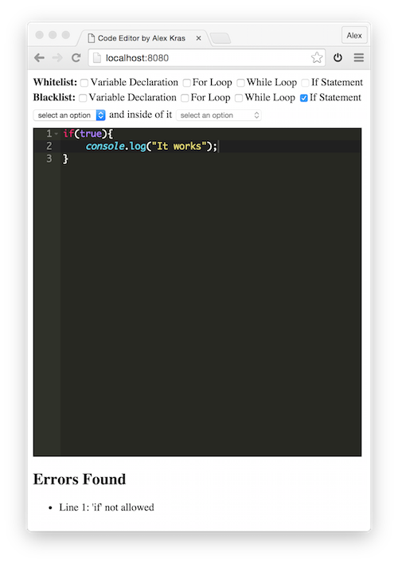

# Sample Code Quality Validator

[DEMO](http://akras14.github.io/code-validator/)

## Overview

- Whitelist - Items that must be found in the code
- Blacklist - Items that must NOT be found in the code
- Structure - 2 level (i.e. For loop must have a while loop inside of it)

Feedback is provided bellow the text editor.

Supports IE8 and above

## Technology Used

 - React
 - Redux
 - Webpack
 - Babel
 - Esprima
 - Webworkers

All Front End code
